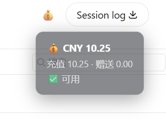

# dsh-emoji-wallet

> A minimal DeepSeek balance wallet for [DeepSeek Harness](https://github.com/deepseek-ai/deepseek-harness): one click shows your API balance right in the session header.
>
> DSH 余额小钱包：顶栏一个 💰，点一下就知道 DeepSeek API 还剩多少钱。



## Features / 功能

- 💰 **One-click balance** — a small wallet button in the session header (right side, next to Session log)
- 🔒 **Key never leaves the host** — the browser only ever sees the balance numbers; the API key is read from the harness credentials file (`~/.dsh/.credentials.yaml`) on the host
- 🫧 **Semi-transparent bubble** — click to open, click again to close (auto-closes after 8s)
- 🎛️ **No config needed** — reads `DEEPSEEK_API_KEY` automatically

## Install / 安装

```bash
dsh plugin --profile web add dsh-emoji-wallet
```

Restart the harness. A 💰 button appears in the session header, right next to
Session log. Click it to see your balance.

## How it works / 原理

- Host half: `GET /api/wallet/balance` reads `DEEPSEEK_API_KEY` from
  `~/.dsh/.credentials.yaml` and queries `https://api.deepseek.com/user/balance`
- Client half: a slot component in `conversation.session.header.utilities`
  (the same container as Session log), positioned before it with flex
  `order: -1`

## License

MIT
